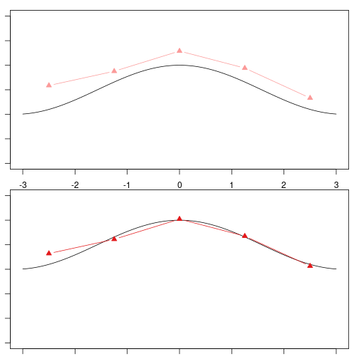
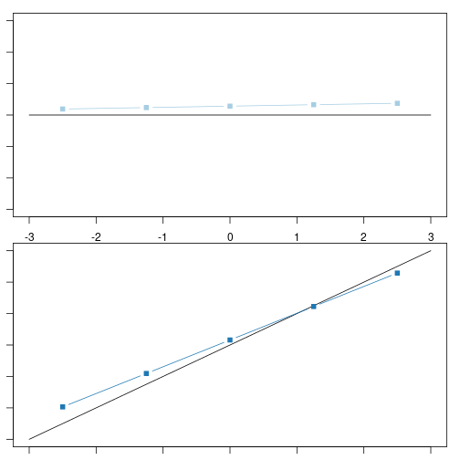

o---
title: "Overview of Heterogenous Nonlinear IV w/ BART"
output: rmarkdown::html_vignette
vignette: >
  %\VignetteIndexEntry{Overview of Heterogenous Nonlinear IV w/ BART}
  %\VignetteEngine{knitr::rmarkdown}
  %\VignetteEncoding{UTF-8}

author: Charles Spanbauer
date: 2022-04-12
---

# Overview

Package <tt>hnpivbart</tt> functions in the same way as other BART-based packages such as <tt>BART3</tt> or <tt>bartMachine</tt>. The user must specify the input training dataset as well as any test points on which to evaluate the estimated regression function. The software runs the BART algorithm and yields samples from the posterior distribution for the predictions on each of the training and test points. The posterior samples from any other unknowns in the model such as error variances are also estimated. There are four functions that can be called <tt>ivbart</tt> (linear global), <tt>hetivbart</tt> (linear heterogenous), <tt>npivbart</tt> (nonlinear global), and <tt>hetnpivbart</tt> (nonlinear heterogenous), the four models discussed in Spanbauer and Pan (20XX).    

For the instrumental variable case, that means specifying the instrument vector/matrix <tt>Z</tt>, the exposure vector <tt>T</tt>, the outcome vector <tt>Y</tt>, and the vector/matrix of other covariates <tt>X</tt>. The outputs will depend on the model specified. In all cases, the first stage is returned via element <tt>df1</tt> from the resulting BART model fit. The outputs, called <tt>df21</tt>, <tt>df22</tt>, and <tt>df2</tt>, otherwise vary depending on the functional form chosen for stage 2. These outputs correspond to the functions $f_{21}$, $f_{22}$ and $f_2$ as given in Table \@ref(tab:foo). Note that <tt>ivbart</tt> <tt>hetnpivbart</tt> does not output <tt>df21</tt> or <tt>df22</tt> as these functions are not estimated separately.

Table: \@ref(tab:foo) Different forms of function $f_2$

|            |                          $f_2(t_i,\mathbf{x}_i)$ |
|------------|-------------------------------------------------:|
| ivBART-g   |               $\beta t_i + f_{21}(\mathbf{x}_i)$ |
| npivBART-g |             $f_{21}(t_i) + f_{22}(\mathbf{x}_i)$ |
| ivBART-h   | $f_{21}(\mathbf{x}_i)t_i + f_{22}(\mathbf{x}_i)$ |
| npivBART-h |                          $f_2(t_i,\mathbf{x}_i)$ |

Test points are specified using inputs <tt>Z.test</tt>, <tt>T.test</tt>, and <tt>X.test</tt> which yield posterior samples of the predictions. When specified, these give outputs called <tt>df1.test</tt>, <tt>df21.test</tt>, <tt>df22.test</tt>, and <tt>df2.test</tt> analogous to the table above. Note that when calling <tt>hetnpivbart</tt>, the length of <tt>T.test</tt> and the number of rows of <tt>X.test</tt> must be equal. For the other functions this is not the case and specifying an unequal number of test points between the inputs will simply yield a different number of predictions for each individual functional.

Using these functions and processing the output are demonstrated through a basic simulation in this section.


```r
n <- 1000
nd <- 1000
nb <- 2500
nb0 <- 1
ke <- 5
pZ <- 10

sig. <- matrix(c(1,rep(0.7,2),1),nrow=2)
chl. <- chol(sig.)
Z. <- matrix(rnorm(n*pZ,sd=.5),ncol=pZ)
ZP. <- matrix(rnorm(10e3*pZ,sd=.5),ncol=pZ)
f1. <- sin(pi*Z.[,1]*Z.[,2])+Z.[,3]^2+2*Z.[,4]+Z.[,5]
f1P. <- sin(pi*ZP.[,1]*ZP.[,2])+ZP.[,3]^2+2*ZP.[,4]+ZP.[,5] 
stdNorm <- matrix(rnorm(n*2),ncol=2)
T. <- (f1. - mean(f1P.))/sd(f1P.) + chl.[1,1]*stdNorm[,1]
X. <- matrix(runif(n*10,min=-1,max=1),nrow=n)
xt <- cbind(T.,X.)[rep(1:n,each=10),]
Tgrd <- seq(-2.5,2.5,length.out=5)
xt[,1] <- rep(rep(Tgrd,2),n)
xt[,2] <- rep(rep(c(-.5,.5),each=5),n)

cols <- c("grey85","grey65","#FB9A99","#E31A1C","#A6CEE3","#1F78B4",
          "#FDBF6F","#FF7F00","#B2DF8A","#33A02C","#CAB2D6","#6A3D9A")
```

    
## Simulate Data; Global Linear

First, the data is simulated according to the specifications in Spanbauer and Pan (20XX). The only difference is that normal random variates are used as the instruments instead of SNPs from gene FTO as in the article. This is done primarily for simplicity, but will not affect the results. We are using the global linear setting here so that $f_2(t_i,\mathbf{x}_i)=t_i+I(x_{i1}\ge 0)$.
    

```r
Y. <- T. + ifelse(X.[,1]<0,0,1) + chl.[1,2]*stdNorm[,1] + chl.[2,2]*stdNorm[,2]
muY. <- 0#mean(Y.)
Y. <- Y.-muY.
dat <- data.frame(cbind(Y.,T.,Z.,X.))
colnames(dat) <- c('Y','T',paste0('Z',1:pZ),paste0('X',1:10))
```

## Run ivBART-g


```r
      ivbNODPLS <- list()
        for(chn in 1:3){
            ivbNODPLS[[chn]] <- ivbart(Z=dat[,3:12],
                                       T=dat$T,
                                       Y=dat$Y,
                                       X=dat[,13:22],
                                       X.test=xt[,-1],T.test=xt[,1],
                                       doDP=FALSE,quiet=TRUE,m1=50,m2=50,
                                       nd=nd/3,keepevery=ke,burn=nb,burnf1=nb0,burnf22=nb0)
           }
        ## Partial dependence
        ivbNODP.pdf <- muY.+
            t(apply(rbind(ivbNODPLS[[1]]$df2.test,
                          ivbNODPLS[[2]]$df2.test,
                          ivbNODPLS[[3]]$df2.test),
                    1,by,rep(1:10,nrow(dat)),mean))
    print(dim(ivbNODP.pdf))
```

```
## [1] 999  10
```

```r
    plot(1,type='n',xlim=c(1,nd/3),ylab=expression(beta),xlab='MCMC Iteration')
    lines(y=ivbNODPLS[[1]]$dbeta,x=1:(nd/3),type='l',col='forestgreen')
    lines(y=ivbNODPLS[[2]]$dbeta,x=1:(nd/3),type='l',col='darkblue')
    lines(y=ivbNODPLS[[3]]$dbeta,x=1:(nd/3),type='l',col='darkred')
```


```r
    T.bigGrid <- seq(-3,3,length.out=100)
    par(mfrow=c(2,1),mar=rep(1,4))
    plot(1,type='n',xlim=c(-3,3),ylim=c(-5,5))
    lines(y=T.bigGrid,x=T.bigGrid,type='l')
    arrows(x0=Tgrd,x1=Tgrd,y0=apply(ivbNODP.pdf,2,mean)[1:5],y1=apply(ivbNODP.pdf,2,quantile,.025)[1:5],code=2,col='black',angle=90,length=.05,lwd=1.5)
    arrows(x0=Tgrd,x1=Tgrd,y0=apply(ivbNODP.pdf,2,mean)[1:5],y1=apply(ivbNODP.pdf,2,quantile,.975)[1:5],code=2,col='black',angle=90,length=.05,lwd=1.5)
    lines(y=colMeans(ivbNODP.pdf)[1:5],x=Tgrd,type='b',col=cols[7],pch=-as.hexmode("2605"),bg=cols[7])
    plot(1,type='n',xlim=c(-3,3),ylim=c(-5,5))
    lines(y=1+T.bigGrid,x=T.bigGrid,type='l')
    arrows(x0=Tgrd,x1=Tgrd,y0=apply(ivbNODP.pdf,2,mean)[6:10],y1=apply(ivbNODP.pdf,2,quantile,.025)[6:10],code=2,col='black',angle=90,length=.05,lwd=1.5)
    arrows(x0=Tgrd,x1=Tgrd,y0=apply(ivbNODP.pdf,2,mean)[6:10],y1=apply(ivbNODP.pdf,2,quantile,.975)[6:10],code=2,col='black',angle=90,length=.05,lwd=1.5)
    lines(y=colMeans(ivbNODP.pdf)[6:10],x=Tgrd,type='b',col=cols[8],pch=-as.hexmode("2605"),bg=cols[8])
    arrows(x0=Tgrd[1],x1=Tgrd[1],y0=apply(ivbNODP.pdf,2,mean)[6],y1=apply(ivbNODP.pdf,2,quantile,.975)[6],code=0,col='black') 
```


    
## Simulate Data; Global Nonlinear

Now the line is replaced with the cosine function so that $f_2(t_i,\mathbf{x}_i)=\cos(t_i)+I(x_{i1}\ge 0)$.
    

```r
Y. <- cos(T.) + ifelse(X.[,1]<0,0,1) + chl.[1,2]*stdNorm[,1] + chl.[2,2]*stdNorm[,2]
muY. <- 0#mean(Y.)
Y. <- Y.-muY.
dat <- data.frame(cbind(Y.,T.,Z.,X.))
colnames(dat) <- c('Y','T',paste0('Z',1:pZ),paste0('X',1:10))
```

    
## Run npivBART-g


```r
      npivbNODPLS <- list()
        for(chn in 1:3){
            npivbNODPLS[[chn]] <- npivbart(Z=dat[,3:12],
                                           T=dat$T,
                                           Y=dat$Y,
                                           X=dat[,13:22],
                                           X.test=xt[,-1],T.test=xt[,1],
                                           doDP=FALSE,quiet=TRUE,m1=50,m2=50,
                                           nd=nd/3,keepevery=ke,burn=nb,burnf1=nb0,burnf22=nb0)
           }
        ## Partial dependence
        npivbNODP.pdf <- muY.+
            t(apply(rbind(npivbNODPLS[[1]]$df2.test,
                          npivbNODPLS[[2]]$df2.test,
                          npivbNODPLS[[3]]$df2.test),
                    1,by,rep(1:10,nrow(dat)),mean))
    print(dim(npivbNODP.pdf))
```

```
## [1] 999  10
```

```r
    T.bigGrid <- seq(-3,3,length.out=100)
    par(mfrow=c(2,1),mar=rep(1,4))
    plot(1,type='n',xlim=c(-3,3),ylim=c(-3,3))
    lines(y=cos(T.bigGrid),x=T.bigGrid,type='l')
    lines(y=colMeans(npivbNODP.pdf)[1:5],x=Tgrd,type='b',col=cols[3],pch=24,bg=cols[3])
    plot(1,type='n',xlim=c(-3,3),ylim=c(-3,3))
    lines(y=cos(T.bigGrid)+1,x=T.bigGrid,type='l')
    lines(y=colMeans(npivbNODP.pdf)[6:10],x=Tgrd,type='b',col=cols[4],pch=24,bg=cols[4])
```



## Simulate Data; Heterogenous Linear

The original line is now interacting with $\mathbf{x}_{1i}$ so that $f_2(t_i,\mathbf{x}_i)=t_iI(x_{i1}\ge 0)$.
    

```r
Y. <- T. * ifelse(X.[,1]<0,0,1) + chl.[1,2]*stdNorm[,1] + chl.[2,2]*stdNorm[,2]
muY. <- 0#mean(Y.)
Y. <- Y.-muY.
dat <- data.frame(cbind(Y.,T.,Z.,X.))
colnames(dat) <- c('Y','T',paste0('Z',1:pZ),paste0('X',1:10))
```

## Run ivBART-h


```r
      hetivbNODPLS <- list()
        for(chn in 1:3){
            hetivbNODPLS[[chn]] <- hetivbart(Z=dat[,3:12],
                                           T=dat$T,
                                           Y=dat$Y,
                                           X=dat[,13:22],
                                           X.test=xt[,-1],T.test=xt[,1],
                                           doDP=FALSE,quiet=TRUE,m1=50,m2=50,
                                           nd=nd/3,keepevery=ke,burn=nb,burnf1=nb0,burnf2=nb0)
           }
        ## Partial dependence
        hetivbNODP.pdf <- muY.+
            t(apply(rbind(hetivbNODPLS[[1]]$df2.test,
                          hetivbNODPLS[[2]]$df2.test,
                          hetivbNODPLS[[3]]$df2.test),
                    1,by,rep(1:10,nrow(dat)),mean))
    print(colMeans(hetivbNODP.pdf))
```

```
##            1            2            3            4            5            6 
## -0.047832601 -0.029173260 -0.010513920  0.008145421  0.026804761 -0.505211693 
##            7            8            9           10 
## -0.248369562  0.008472570  0.265314702  0.522156833
```

```r
    print(dim(hetivbNODP.pdf))
```

```
## [1] 999  10
```

```r
    T.bigGrid <- seq(-3,3,length.out=100)
    par(mfrow=c(2,1),mar=rep(1,4))
    plot(1,type='n',xlim=c(-3,3),ylim=c(-3,3))
    lines(y=rep(0,100),x=T.bigGrid,type='l')
    lines(y=colMeans(hetivbNODP.pdf)[1:5],x=Tgrd,type='b',col=cols[5],pch=22,bg=cols[5])
    plot(1,type='n',xlim=c(-3,3),ylim=c(-3,3))
    lines(y=T.bigGrid,x=T.bigGrid,type='l')
    lines(y=colMeans(hetivbNODP.pdf)[6:10],x=Tgrd,type='b',col=cols[6],pch=22,bg=cols[6])
```



# Simulate Data; Heterogenous Nonlinear

The nonlinear cosine function is now multiplicative with $\mathbf{x}_{1i}$ so that $f_2(t_i,\mathbf{x}_i)=t_iI(x_{i1}\ge 0)$.        
    

```r
Y. <- cos(T.) * ifelse(X.[,1]<0,0,1) + chl.[1,2]*stdNorm[,1] + chl.[2,2]*stdNorm[,2]
muY. <- 0#mean(Y.)
Y. <- Y.-muY.
dat <- data.frame(cbind(Y.,T.,Z.,X.))
colnames(dat) <- c('Y','T',paste0('Z',1:pZ),paste0('X',1:10))
```

## Run ivBART-h


```r
      hetnpivbNODPLS <- list()
        for(chn in 1:3){
            hetnpivbNODPLS[[chn]] <- hetnpivbart(Z=dat[,3:12],
                                                 T=dat$T,
                                                 Y=dat$Y,
                                                 X=dat[,13:22],
                                                 X.test=xt[,-1],T.test=xt[,1],
                                                 doDP=FALSE,quiet=TRUE,m1=50,m2=50,
                                                 nd=nd/3,keepevery=ke,burn=nb,burnf1=nb0,burnf2=nb0)
           }
        ## Partial dependence
        hetnpivbNODP.pdf <- muY.+
            t(apply(rbind(hetnpivbNODPLS[[1]]$df2.test,
                          hetnpivbNODPLS[[2]]$df2.test,
                          hetnpivbNODPLS[[3]]$df2.test),
                    1,by,rep(1:10,nrow(dat)),mean))
    print(dim(hetnpivbNODP.pdf))
```

```
## [1] 999  10
```

```r
    T.bigGrid <- seq(-3,3,length.out=100)
    par(mfrow=c(2,1),mar=rep(1,4))
    plot(1,type='n',xlim=c(-3,3),ylim=c(-3,3))
    lines(y=rep(0,100),x=T.bigGrid,type='l')
    lines(y=colMeans(hetnpivbNODP.pdf)[1:5],x=Tgrd,type='b',col=cols[1],pch=21,bg=cols[1])
    plot(1,type='n',xlim=c(-3,3),ylim=c(-3,3))
    lines(y=cos(T.bigGrid),x=T.bigGrid,type='l')
    lines(y=colMeans(hetnpivbNODP.pdf)[6:10],x=Tgrd,type='b',col=cols[2],pch=21,bg=cols[2])
```


## Arguments <tt>null.f1</tt> and <tt>null.f2</tt>

Traditional non-IV BART can be run by specifying <tt>null.f1=TRUE</tt> and specifying <tt>T</tt>, <tt>X</tt>, and <tt>Y</tt> respectively. In this case, the specification of <tt>Z</tt> is arbitrary because it is ignored. Alternatively, this could be specified as <tt>null.f1=TRUE</tt> with <tt>Y</tt> and <tt>X</tt> ignored. In this case, <tt>Z</tt> is the predictor matrix and <tt>T</tt> is the outcome.
    
## Run Traditional BART


```r
      ## null.f1 boolean specifies whether to estimate function f1
      bNODPLS <- list()
        for(chn in 1:3){
            bNODPLS[[chn]] <- hetnpivbart(Z=dat[,3:12],
                                          T=dat$T,
                                          Y=dat$Y,
                                          X=dat[,13:22],
                                          X.test=xt[,-1],T.test=xt[,1],
                                          doDP=FALSE,quiet=TRUE,m1=50,m2=50,
                                          nd=nd/3,keepevery=ke,burn=nb,burnf1=nb0,
                                          burnf2=nb0,
                                          null.f1=TRUE
    )
           }
        ## Partial dependence
        bNODP.pdf <- mean(dat[,1])+
            t(apply(rbind(bNODPLS[[1]]$df2.test,
                          bNODPLS[[2]]$df2.test,
                          bNODPLS[[3]]$df2.test),
                    1,by,rep(1:10,nrow(dat)),mean))
    print(dim(bNODP.pdf))
```

```
## [1] 999  10
```

```r
    T.bigGrid <- seq(-3,3,length.out=100)
    par(mfrow=c(2,1),mar=c(3,1,1,1))
    plot(1,type='n',xlim=c(-3,3),ylim=c(-3,3),main=expression(x[1]<0),ylab=expression(f[2]),xlab=expression(t))
    lines(y=rep(0,100),x=T.bigGrid,type='l')
    lines(y=colMeans(bNODP.pdf)[1:5],x=Tgrd,type='b',col=cols[11],pch=25,bg=cols[11])
    plot(1,type='n',xlim=c(-3,3),ylim=c(-3,3),main=expression(x[1]>0),ylab=expression(f[2]),xlab=expression(t))
    lines(y=cos(T.bigGrid),x=T.bigGrid,type='l')
    lines(y=colMeans(bNODP.pdf)[6:10],x=Tgrd,type='b',col=cols[12],pch=25,bg=cols[12])
```


